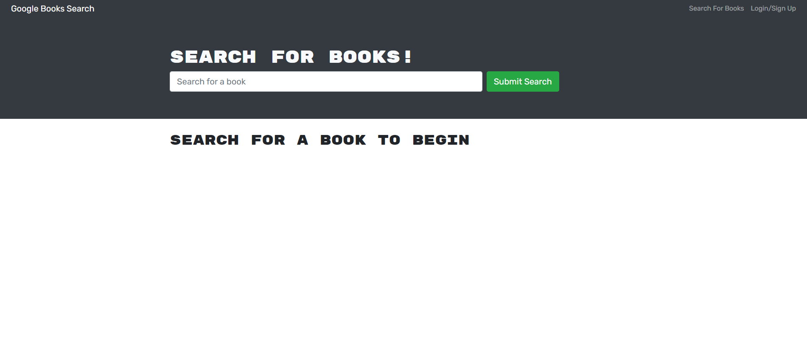
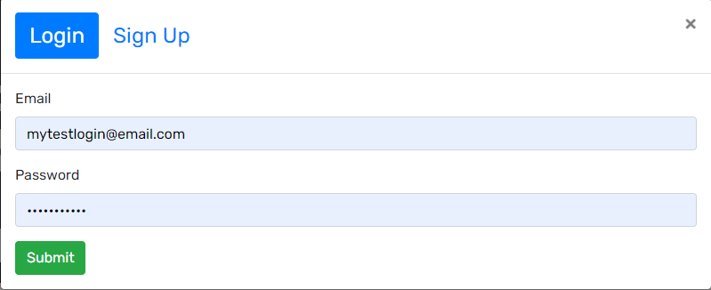
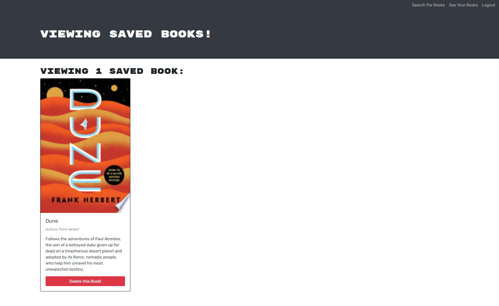
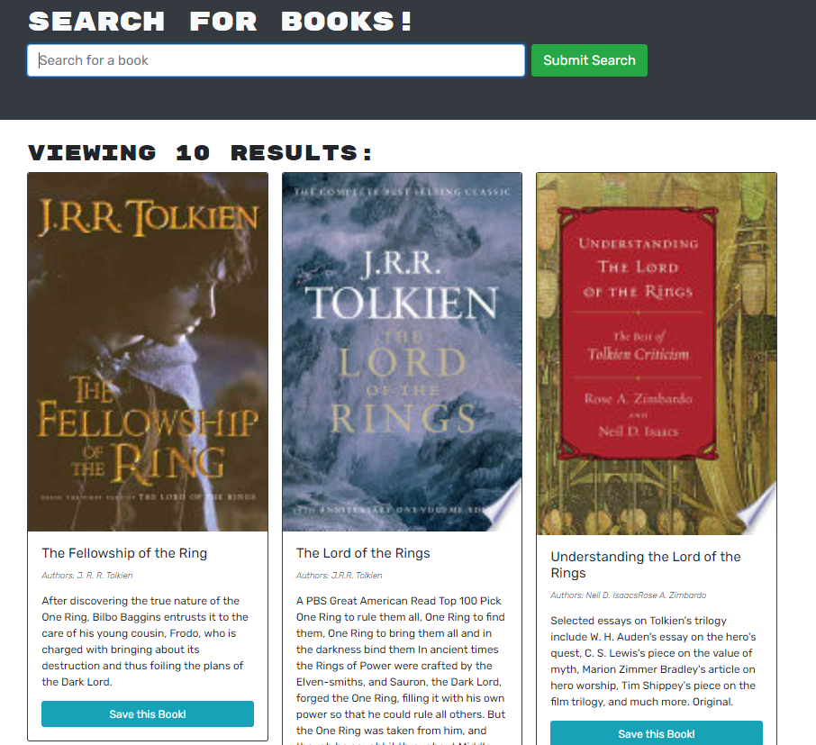
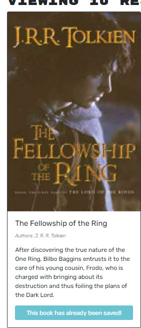
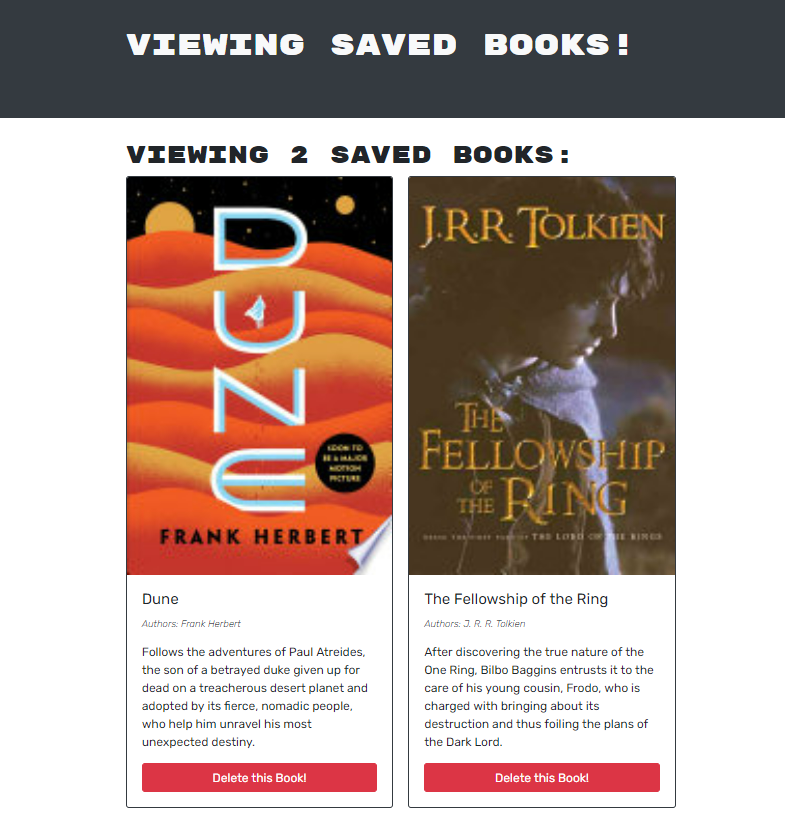
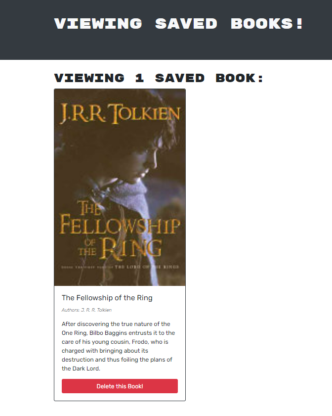

# MERN-SE-Refactor

## Description:
The purpose of this exercise was to modify a fully functioning React app that a user could create a profile, login, search out their favorite books, save and delete them. The fully functioning code utilized express routing and RESTful route structure, using CRUD operations. We were then taksed to refactor this code, to utilize the Apollo provider, server, client and graphQL for conditional rendering, context for inheritance and React routing to recreate the exact same user experience.

## Technologies Utilized:
- Javascript
- Node 
- React
- Apollo Express server
- Apollo Client
- Apollo Provider
- JWT
- BCrypt
- Mongoose
- Mongo Atlas
- Heroku

## Installation & Use:

### To install necessary packages:
- While in the directory, type in command line: npm i
- 'npm run develop' in command line

## Screenshots:
### Landing Screen

### Login Modal

### Initial Saved Book

### Searching Books

### Saved A Book

### Updated Saved Books

### Deleted A Book

## Challenges & Thoughts:
- Testing was difficult, The assignment readMe was a great guide on where to work, however I was not great at coding in small bunches and testing with this app. In retrospect, I feel I should have completed the JWT authorization and login portion of this refactor first before moving on to queries and mutations, etc. 
- Lots of small syntax issues broke pieces of this app, however React was very helpful in reporting it's errors when compiling and when doing certain actions. It certainly made my life easier.
- I could probably clean up the scope of my queries and mutations for efficiency; however getting the app to work as it originally did was challenging and time consuming.
- This was great exercise and example of something a junior dev might work on to adapt existing apps to new framework and technologies.

## Questions/Links:
https://github.com/MarkAndersen
 
https://pacific-dawn-55437.herokuapp.com/
 
[Email me](mailto:Mark.Andersen75@gmail.com)
